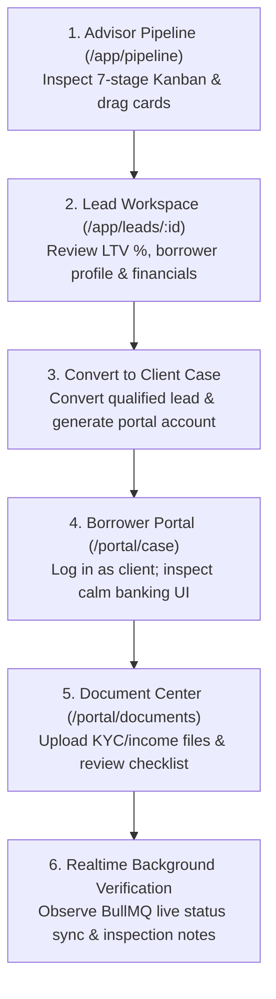

# LeadFlow Employee Training & System Workflow Manual

> **Welcome to the LeadFlow Team!**  
> This manual is your comprehensive onboarding guide to mastering LeadFlow. Whether you are a Mortgage Advisor, a Brokerage Administrator, or a Platform Operator, this document teaches you how LeadFlow works from the ground up, why our operational processes are structured the way they are, and how to execute every daily workflow with speed, accuracy, and confidence.

---

## Table of Contents
1. [What LeadFlow Is and What Problem It Solves](#1-what-leadflow-is-and-what-problem-it-solves)
2. [The Four User Roles & Responsibilities](#2-the-four-user-roles--responsibilities)
3. [The Complete Lifecycle of a Mortgage Enquiry](#3-the-complete-lifecycle-of-a-mortgage-enquiry)
4. [Where Leads Come From: Typeform Webhook Ingestion](#4-where-leads-come-from-typeform-webhook-ingestion)
5. [The Advisor's Daily Workflow](#5-the-advisors-daily-workflow)
6. [Pipeline Stages: Operational Action Guide](#6-pipeline-stages-operational-action-guide)
7. [Automated Tasks & Email Triggers](#7-automated-tasks--email-triggers)
8. [Client Conversion: What Happens When You Click "Convert"](#8-client-conversion-what-happens-when-you-click-convert)
9. [The Borrower Experience (Client Portal Walkthrough)](#9-the-borrower-experience-client-portal-walkthrough)
10. [Document Verification: Business Flow & Technical Mechanics](#10-document-verification-business-flow--technical-mechanics)
11. [Domain Concepts: Understanding the Differences](#11-domain-concepts-understanding-the-differences)
12. [Role-Based Access Control (RBAC) Reference](#12-role-based-access-control-rbac-reference)
13. [Common Employee Situations & Troubleshooting Guide](#13-common-employee-situations--troubleshooting-guide)
14. [End-to-End Walkthrough: Priya's Home Loan Journey](#14-end-to-end-walkthrough-priyas-home-loan-journey)
15. [First-Day Checklists by Role](#15-first-day-checklists-by-role)
16. [10-Minute Reviewer Demo Walkthrough](#16-10-minute-reviewer-demo-walkthrough)
17. [Glossary of LeadFlow Terminology](#17-glossary-of-leadflow-terminology)
18. [How LeadFlow Works in One Page (System Workflow Diagram)](#18-how-leadflow-works-in-one-page-system-workflow-diagram)

---

## 1. What LeadFlow Is and What Problem It Solves

### The Real-World Challenge
In the retail mortgage and housing finance sector in India, taking a home loan from initial inquiry to final disbursement is historically chaotic. Brokerages and Direct Selling Agents (DSAs) routinely face:
- **Lead Leakage & Dropped Inquiries**: High-intent borrowers submit forms on property portals (MagicBricks, 99acres, Housing.com) or marketing landing pages (Typeform, Meta Ads), only for their inquiries to sit unattended in email inboxes or unorganized spreadsheets for days.
- **Document Disarray**: Borrowers send identity proofs, salary slips, bank statements, and property blueprints over personal WhatsApp chats and unencrypted emails. Files get lost, KYC compliance is compromised, and loan files stall.
- **Multiple Disconnected Tools**: Advisors juggle one tool for tracking calls, another for emailing checklists, and a shared drive for files.
- **Cross-Brokerage Data Contamination**: In multi-tenant environments, keeping one firm's borrowers strictly separated from another's is a critical data-privacy and regulatory mandate.

### How LeadFlow Solves It
LeadFlow is a high-performance, multi-tenant mortgage brokerage operating system and Loan Origination platform that unites the entire journey under one roof:
1. **Automated Ingestion**: Ingests leads instantly from external forms (Typeform) with zero manual copy-pasting, constant-time HMAC security, and duplicate absorption.
2. **Visual 7-Stage Pipeline**: Provides a Kanban board enforcing a strict qualification state machine with live Socket.IO synchronization.
3. **1-Click Client Case Conversion**: Converts qualified prospective leads into formal borrower case dossiers and automatically provisions dedicated self-service borrower portal credentials.
4. **Calm, Institutional Borrower Portal**: Gives applicants a private, transparent portal where they see their loan parameters in Indian Rupees (INR ₹), dynamic Loan-to-Value (`LTV %`) calculations, an application milestone progress tracker, and a 4-pillar document checklist.
5. **Background Verification with Live Status**: Asynchronously checks files for KYC and salary verification without freezing advisor screens, updating statuses live on both advisor and borrower monitors.
6. **Trigger Automations & Tasks**: Automatically schedules follow-up tasks and dispatches template emails when deals change stages.

---

## 2. The Four User Roles & Responsibilities

LeadFlow enforces strict Role-Based Access Control (RBAC). Every employee account is assigned exactly one role:

| Role | Operational Responsibility | What They Use LeadFlow For |
| :--- | :--- | :--- |
| **Platform Admin** (`PLATFORM_ADMIN`) | System Superadmin / Platform Operator | Oversees all partner brokerages on the platform, monitors system uptime, creates new brokerage accounts, verifies tenant isolation boundaries, and reviews global audit logs. Does not handle daily borrower files. |
| **Brokerage Admin** (`BROKERAGE_ADMIN`) | Operations Manager / Principal Broker | Manages the brokerage team, views operational dashboards and conversion KPIs, configures pipeline stage triggers (`CREATE_TASK`, `SEND_EMAIL`), creates email templates with dynamic tokens, and can reassign leads and cases across advisors. |
| **Mortgage Advisor** (`ADVISOR`) | Loan Officer / Mortgage Specialist / DSA Agent | The front-line professional. Receives new leads, conducts discovery calls, evaluates credit eligibility, advances leads through the 7-stage Kanban pipeline, converts leads into client cases, monitors document submissions, and works daily tasks. |
| **Client / Borrower** (`CLIENT`) | Home Loan Applicant / Borrower | The external customer. Logs into the dedicated `/portal/*` to track their home loan application progress, view assessed financing terms (Loan Amount, Property Value, LTV %), review required documents, upload KYC/income files, view verification notes, and contact their dedicated advisor. |

---

## 3. The Complete Lifecycle of a Mortgage Enquiry

Every mortgage inquiry in LeadFlow follows a predictable, structured progression:

```
[ External Lead Source ]
  (e.g., Typeform Webhook / Marketing Landing Page)
          │
          ▼
[ LeadFlow Ingestion Engine ]
  (HMAC Authentication → Payload Normalization → Scoped Deduplication)
          │
          ▼
[ 1. New Lead Ingested ] (Stage: NEW)
  (Auto-triggers: Welcome Email dispatched + Initial Outreach Task created)
          │
          ▼
[ 2. Advisor Outreach & Qualification ] (Stages: CONTACTED → QUALIFIED)
  (Advisor contacts borrower, evaluates income, property budget, CIBIL eligibility)
          │
          ▼
[ 3. Structuring & Negotiation ] (Stages: PROPOSAL → NEGOTIATION)
  (Comparing lender interest rates across SBI, HDFC, ICICI; negotiating tenure and processing fees)
          │
          ▼
[ 4. Client Conversion ] (Click "Convert to Client Case")
  (Lead transitions to WON; Client Profile created; Borrower Portal User account provisioned)
          │
          ▼
[ 5. Borrower Portal Self-Service ]
  (Borrower logs in at /portal/case; reviews financing specs in INR ₹; sees 4-step progress stepper)
          │
          ▼
[ 6. Document Upload & Checklist ]
  (Borrower uploads PAN, Aadhaar, 3-Month Salary Slips, 6-Month Bank Statements, Property Agreement)
          │
          ▼
[ 7. Background Verification ]
  (BullMQ queue inspects files asynchronously; realtime WebSockets broadcast VERIFIED / REJECTED status)
          │
          ▼
[ 8. Final Sanction & Disbursement ]
  (Bank issues formal Sanction Letter; advisor coordinates property legal check and disbursement)
```

---

## 4. Where Leads Come From: Typeform Webhook Ingestion

You never need to manually enter inbound website leads into LeadFlow. External lead capture is completely automated.

```
┌─────────────────┐       HTTP POST with JSON Payload       ┌───────────────────────────────┐
│                 │ ──────────────────────────────────────> │  LeadFlow Ingestion Endpoint  │
│  Typeform Form  │   Header: x-webhook-secret: <secret>    │  POST /api/leads/webhook/:id  │
│                 │   or x-signature-sha256: <hash>         └───────────────┬───────────────┘
└─────────────────┘                                                         │
                                                                            ▼
                                                            ┌───────────────────────────────┐
                                                            │   HMAC & Secret Validation   │
                                                            │   (Constant-Time Equal Check) │
                                                            └───────────────┬───────────────┘
                                                                            │
                                                                            ▼
                                                            ┌───────────────────────────────┐
                                                            │     Payload Normalization     │
                                                            │  - Maps answers to fields     │
                                                            │  - Strips untrusted inputs    │
                                                            │  - Extracts loan/income data  │
                                                            └───────────────┬───────────────┘
                                                                            │
                                                                            ▼
                                                            ┌───────────────────────────────┐
                                                            │     Scoped Deduplication      │
                                                            │    { brokerageId, email }     │
                                                            └───────┬───────────────┬───────┘
                                                                    │               │
                                                       If Duplicate │               │ If New Lead
                                                                    ▼               ▼
                                                            ┌───────────────┐ ┌───────────────┐
                                                            │ Return 200 OK │ │ Persist Lead  │
                                                            │ Existing File │ │ Status: NEW   │
                                                            └───────────────┘ └───────┬───────┘
                                                                                      │
                                                                                      ▼
                                                                              ┌───────────────┐
                                                                              │ Fire Stage    │
                                                                              │ Automations   │
                                                                              │ (Email & Task)│
                                                                              └───────────────┘
```

### 1. The Ingestion Endpoint
Each brokerage has a dedicated, secure webhook ingestion URL:
`POST /api/leads/webhook/:brokerageId`

### 2. What Information Typeform Sends
When a borrower completes your website's home loan questionnaire, Typeform sends an event payload containing:
- `event_id`: Unique delivery ID from Typeform.
- `form_response`: Form identifier and submission timestamp.
- `form_response.answers`: An array of individual answers given by the applicant.
- `form_response.hidden`: Marketing metadata, such as campaign name or `utm_source`.

### 3. How LeadFlow Authenticates and Validates the Ingestion
Before opening the data, LeadFlow performs a security handshake:
- **Dual Authentication**: LeadFlow verifies the incoming request using either the brokerage's shared secret (`x-webhook-secret` or `Authorization: Bearer <secret>`) or a cryptographic HMAC-SHA256 signature (`x-signature-sha256`).
- **Constant-Time Verification**: Uses constant-time memory comparisons to prevent timing attacks.
- **Tenant-Aware Rate Limiting**: The endpoint allows up to 1,000 requests per minute per verified brokerage. High-volume marketing campaigns (e.g., 500 leads bursting in minutes) are ingested smoothly without server throttling.

### 4. How the Payload Is Normalized
Typeform formats answers by field ID (e.g., `field: { id: "abc123email" }`). LeadFlow's normalization engine automatically inspects the answers:
- Finds the email answer by inspecting field type or reference tags.
- Extracts First Name and Last Name. If the form asked for a single "Full Name", it splits the string into first and last names.
- Extracts Phone Number.
- Collects all financial and mortgage requirements into `customFields`:
  - `loanAmount`: Requested loan amount in INR.
  - `propertyValue`: Target property valuation.
  - `monthlyGrossIncome`: Applicant's gross monthly salary.
  - `downPayment`: Proposed down payment savings.
  - `propertyCity`: City of purchase (e.g., Mumbai, Bengaluru, Delhi NCR).
- Maps `utm_source` (e.g., `WEBSITE`, `REFERRAL`, `ZILLOW`) to standard Lead Sources.
- **Security Stripping**: Any untrusted `brokerageId` sent inside the payload body is discarded; the lead is strictly assigned to the verified URL parameter brokerage.

### 5. Scoped Deduplication & "Already Known" Detection
LeadFlow checks the database for `{ brokerageId: 1, email: 1 }`:
- **If the Lead is New**: LeadFlow inserts a new `Lead` document with `status: 'NEW'` and fires configured stage automations (such as sending a welcome email and creating an outreach task).
- **If the Lead Already Exists**: LeadFlow returns the existing record idempotently (`isDuplicate: true`, HTTP 200). It does not create duplicate cards on the advisor's board.
- **If the Person is an Existing Client**: If the email matches an already-active borrower in the brokerage, LeadFlow flags the lead with `isAlreadyKnown: true` and `knownAs: 'CLIENT'`, linking the existing client profile so the advisor immediately sees previous loan history.

### 6. When the Lead Appears on the Pipeline Board
Within milliseconds of webhook receipt, the new lead card appears live in the **NEW** column on the advisor's Kanban board via real-time WebSocket synchronization (`/app/pipeline`).

---

## 5. The Advisor's Daily Workflow

As a Mortgage Advisor, your day revolves around three primary views:

```
                  ┌──────────────────────────────────────────────┐
                  │            Morning Login (/login)            │
                  └──────────────────────┬───────────────────────┘
                                         │
                 ┌───────────────────────┴───────────────────────┐
                 ▼                                               ▼
┌─────────────────────────────────┐             ┌─────────────────────────────────┐
│    1. Check Tasks (/app/tasks)  │             │   2. Pipeline (/app/pipeline)   │
│ - Overdue follow-ups            │             │ - Inspect NEW leads             │
│ - Tasks due today               │             │ - Filter by loan ticket size    │
│ - 1-click status completion     │             │ - Drag cards forward            │
└─────────────────────────────────┘             └────────────────┬────────────────┘
                                                                 │
                                                                 ▼
                                                ┌─────────────────────────────────┐
                                                │   3. Lead Workspace (/leads/:id)│
                                                │ - Review income & LTV %         │
                                                │ - Advance stage stepper         │
                                                │ - Click "Convert to Client Case"│
                                                └────────────────┬────────────────┘
                                                                 │
                                                                 ▼
                                                ┌─────────────────────────────────┐
                                                │   4. Verification (/documents)  │
                                                │ - Track KYC & salary slip status│
                                                │ - Check inspection feedback     │
                                                └─────────────────────────────────┘
```

### 1. Start with the Task Inbox (`/app/tasks`)
- Filter by **Overdue** (marked with a red alert badge) and **Due Today** (amber badge).
- Tasks generated by automated stage triggers (e.g., *"Call new applicant Priya Sharma within 2 hours"*) will appear here with direct links to the relevant lead or client dossier.
- Mark completed tasks with a single click.

### 2. Open the Pipeline Board (`/app/pipeline`)
- Review newly arrived leads in the **NEW** column.
- Use the **Search** bar to locate specific borrowers, or use the **Loan Size Filter** (`≥ ₹25 Lakhs`, `≥ ₹50 Lakhs Jumbo`) to prioritize high-value home purchase files.
- Click on any lead card to open the **Lead Detail Drawer**.

### 3. Conduct Initial Discovery & Advance Stages
- Call or email the borrower using the contact details in the drawer.
- Drag the lead card from **NEW** to **CONTACTED**, then to **QUALIFIED** as you confirm eligibility.
- Review the dynamically computed **Loan-to-Value (LTV %)** ratio in the Financial KPI strip.

### 4. Convert Qualified Leads to Formal Cases
- Once a borrower selects a property and agrees to proceed, click **"Convert to Client Case"** in the lead drawer.
- Provide a portal password (or let LeadFlow generate one).
- The lead moves to **WON**, and a new borrower case dossier is created under `/app/clients/:id`.

### 5. Monitor Live Document Verification (`/app/documents`)
- Monitor incoming KYC and income files uploaded by the borrower.
- Verified files turn green automatically via live WebSocket updates; rejected files display explicit inspector feedback notes.

---

## 6. Pipeline Stages: Operational Action Guide

The LeadFlow Kanban pipeline enforces a linear, compliant qualification progression:
`NEW → CONTACTED → QUALIFIED → PROPOSAL → NEGOTIATION → WON / LOST`

```
  ┌──────┐       ┌───────────┐       ┌───────────┐       ┌──────────┐       ┌─────────────┐       ┌─────┐
  │ NEW  │ ────> │ CONTACTED │ ────> │ QUALIFIED │ ────> │ PROPOSAL │ ────> │ NEGOTIATION │ ────> │ WON │
  └──┬───┘       └─────┬─────┘       └─────┬─────┘       └────┬─────┘       └──────┬──────┘       └─────┘
     │                 │                   │                  │                    │
     └─────────────────┴───────────────────┴──────────────────┴────────────────────┴────────────> ┌──────┐
                                                                                                  │ LOST │
                                                                                                  └──────┘
```

| Pipeline Stage | Business Meaning | Advisor Action Required | Permitted Next Moves |
| :--- | :--- | :--- | :--- |
| **1. NEW** | Fresh inbound inquiry received via Typeform or website. Uncontacted. | Review applicant details and income proof in the Lead Drawer. Attempt telephone contact within 2 hours. | Advance to **CONTACTED** or mark as **LOST** (if invalid number/spam). |
| **2. CONTACTED** | Initial phone or email outreach completed. Discussion underway. | Verify borrower intent, desired property location, expected timeline, and employment stability. | Advance to **QUALIFIED** or mark as **LOST** (borrower dropped out). |
| **3. QUALIFIED** | Borrower meets basic lending criteria (adequate monthly income, acceptable CIBIL score estimate, realistic budget). | Run preliminary LTV calculation. Collect rough budget figures. Eligible for client portal conversion. | Advance to **PROPOSAL**, convert to **CLIENT CASE**, or mark as **LOST**. |
| **4. PROPOSAL** | Formal mortgage rate comparison prepared and presented to borrower. | Share interest rate schemes across lending partners (e.g., SBI floating vs. HDFC hybrid schemes). | Advance to **NEGOTIATION**, convert to **CLIENT CASE**, or mark as **LOST**. |
| **5. NEGOTIATION** | Borrower is finalizing terms with lender (processing fees, loan tenure, sanction conditions). | Finalize sanction conditions with bank credit manager. Lock in processing fee waivers. | Advance to **WON** (conversion), or mark as **LOST**. |
| **6. WON** | Terminal success stage. Borrower accepted terms; formal mortgage case active. | Formal borrower file active. Client portal provisioned. Document collection underway. | *Terminal stage*. No outgoing moves. |
| **7. LOST** | Terminal drop-off stage. Borrower disqualified, purchased elsewhere, or canceled. | Record the drop-off reason in notes for audit and marketing feedback. | *Terminal stage*. No outgoing moves. |

> **Operational Rule**: You can mark a lead as **LOST** from any active stage if the applicant withdraws. However, once marked **LOST** or **WON**, the state machine is locked and cannot be dragged backward.

---

## 7. Automated Tasks & Email Triggers

LeadFlow automates repetitive administrative work so advisors can focus on advisory and client relationships.

```
[ Lead Stage Changes ] ──> [ Trigger Engine Checks Brokerage Rules ]
                                      │
               ┌──────────────────────┴──────────────────────┐
               ▼                                             ▼
     [ Action: CREATE_TASK ]                       [ Action: SEND_EMAIL ]
     - Generates advisor task                      - Resolves email template
     - Calculates dynamic due date                 - Safely substitutes {{placeholders}}
     - Appears in /app/tasks                       - Enqueues to BullMQ Redis worker
     - Flags as overdue if delayed                 - Dispatches without blocking screen
```

### How Automations Work from an Employee's Perspective
1. **Event Triggered**: When a lead enters a stage (for instance, when a new lead enters `NEW`, or an advisor advances a lead to `QUALIFIED`), the trigger engine checks if the Brokerage Admin has created any rules for that stage.
2. **Task Creation**: If an automation rule specifies `CREATE_TASK`, LeadFlow instantly generates a new task in the advisor's task inbox (`/app/tasks`) with a title, description, and dynamic due date (e.g., due in 2 hours or due in 1 day).
3. **Email Dispatch**: If a rule specifies `SEND_EMAIL`, LeadFlow retrieves the designated template, merges borrower details, and dispatches the email through a background queue without freezing the advisor's screen.

### Dynamic Template Placeholders
Templates support intelligent placeholder tokens that substitute real data at dispatch time:
- `{{lead.firstName}}` → The applicant's first name (e.g., Priya).
- `{{lead.lastName}}` → The applicant's last name (e.g., Sharma).
- `{{advisor.name}}` → The assigned mortgage advisor's full name.
- `{{brokerage.name}}` → The brokerage legal business name.
- `{{customFields.loanAmount}}` → The requested loan amount in INR (e.g., ₹48,00,000).
- `{{customFields.propertyCity}}` → The city of purchase (e.g., Bengaluru).

---

## 8. Client Conversion: What Happens When You Click "Convert"

When an inquiry matures into an active application, the advisor clicks **"Convert to Client Case"** in the Lead Drawer.

```
┌─────────────────────────────────┐
│   Advisor clicks "Convert"      │
└────────────────┬────────────────┘
                 │
                 ▼
┌─────────────────────────────────┐
│ 1. Eligibility Check            │ ──> Must be in QUALIFIED, PROPOSAL, NEGOTIATION, or WON
└────────────────┬────────────────┘     (NEW, CONTACTED, and LOST are blocked)
                 │
                 ▼
┌─────────────────────────────────┐
│ 2. Atomic Lead Claim            │ ──> Sets lead.status = 'WON'
└────────────────┬────────────────┘     Sets lead.convertedClientId = <newClientId>
                 │
                 ▼
┌─────────────────────────────────┐
│ 3. Client Dossier Provisioned   │ ──> Creates Client document in MongoDB
└────────────────┬────────────────┘     Copies contact info, address, customFields
                 │
                 ▼
┌─────────────────────────────────┐
│ 4. Portal Account Provisioned   │ ──> Creates User record (role: 'CLIENT')
└────────────────┬────────────────┘     Generates password & hashes with bcrypt
                 │
                 ▼
┌─────────────────────────────────┐
│ 5. Realtime Board Sync          │ ──> Emits WebSocket event; board moves card to WON
└─────────────────────────────────┘     Displays temporary password on advisor screen
```

### The 5 Steps Executed Internally:
1. **Eligibility Enforcement**: LeadFlow verifies that the lead is in an eligible stage (`QUALIFIED`, `PROPOSAL`, `NEGOTIATION`, or `WON`). Raw `NEW` or `CONTACTED` inquiries cannot be converted.
2. **Atomic Lead Transition to WON**: The lead is claimed atomically and transitioned to `WON`. This prevents race conditions if two advisors attempt to convert simultaneously.
3. **Client Profile Creation**: A formal `Client` dossier is created under the brokerage, maintaining a permanent link back to the originating lead (`client.leadId`).
4. **Portal User Account Provisioning**: LeadFlow provisions a portal user account with `role: 'CLIENT'` and `status: 'ACTIVE'`. If you entered a custom password in the modal, that password is encrypted; otherwise, LeadFlow generates a secure temporary password.
5. **Realtime Broadcast**: LeadFlow broadcasts a real-time event to the pipeline board, automatically moving the lead's card to **WON** on all advisor screens. The advisor receives a confirmation dialog with the borrower's login credentials to share with the customer.

---

## 9. The Borrower Experience (Client Portal Walkthrough)

The borrower portal (`/portal/*`) provides a calm, institutional banking experience free from marketing fluff and cluttered badges.

```
┌────────────────────────────────────────────────────────────────────────┐
│                        Portal Navigation Bar                           │
│  [ LeadFlow Portal ]        Case Overview  •  Documents  •  My Advisor │
└───────────────────────────────────┬────────────────────────────────────┘
                                    │
    ┌───────────────────────────────┴───────────────────────────────┐
    ▼                                                               ▼
┌──────────────────────────────────────┐  ┌──────────────────────────────────────┐
│        Case Overview (/portal/case)  │  │   Document Center (/portal/documents)│
│                                      │  │                                      │
│ 1. Header Card                       │  │ 1. 4-Pillar Document Checklist       │
│    - Status: Active Application      │  │    - Identity Proof (PAN / Aadhaar)  │
│    - Ref: #A8F9B2                    │  │    - 3-Month Salary Slips            │
│    - Brokerage: Apex Home Finance    │  │    - 6-Month Bank Statements         │
│                                      │  │    - Property Title / Agreement      │
│ 2. Financing Summary Strip           │  │                                      │
│    - Requested Loan: ₹48,00,000      │  │ 2. Status Metric Buttons             │
│    - Property Value: ₹60,00,000      │  │    - Total Files | Verified | Review │
│    - Loan-to-Value: 80.0% LTV        │  │                                      │
│    - Gross Income: ₹1,25,000         │  │ 3. Non-Blocking File Upload Modal    │
│                                      │  │    - Drag & drop (PDF, JPEG, PNG)    │
│ 3. 4-Step Milestone Stepper          │  │    - Up to 10MB per file             │
│    - Application Submitted (Done)    │  │                                      │
│    - Document Verification (Active)  │  │ 4. Inspection Feedback & Re-upload   │
│    - Underwriting & Valuation        │  │    - Clear feedback on rejected files│
│    - Sanction & Disbursement         │  │    - 1-click contextual replacement  │
│                                      │  └──────────────────────────────────────┘
│ 4. Assigned Advisor Card             │
│    - Direct Email with 1-click copy  │
│    - Direct telephone calling link   │
└──────────────────────────────────────┘
```

### 1. Signing In
The borrower visits `/login` and enters their registered email and password. LeadFlow detects their `CLIENT` role and immediately routes them to `/portal/case`. Borrowers are strictly blocked from internal staff views.

### 2. Case Overview (`/portal/case`)
- **Primary Case Status**: A prominent status badge (`Active Application`, `Under Review`) clearly communicates the standing of their file.
- **Financial Specifications**: Highlights the requested loan amount (`₹48,00,000`), property valuation (`₹60,00,000`), computed LTV ratio (`80.0% LTV`), and gross monthly income.
- **Horizontal Progress Stepper**: Shows where they stand on the 4 key milestones:
  1. *Application Submitted* (Completed)
  2. *Document Verification* (Active — shows live count: e.g. "3 of 5 verified")
  3. *Underwriting & Valuation* (Upcoming)
  4. *Sanction & Disbursement* (Upcoming)
- **Assigned Advisor Desk**: Displays their advisor's name, brokerage partnership, email address (with 1-click copy), and phone number.

### 3. Document Verification Center (`/portal/documents`)
- **Indian Home Loan Document Checklist**: Displays the 4 mandatory verification pillars required by Indian lenders:
  1. *Identity Proof*: PAN Card (mandatory for financial credit check) or Aadhaar.
  2. *Salary Slips*: Last 3 months' pay slips or Form 16.
  3. *Bank Account Statement*: Last 6 months' salary bank statements.
  4. *Property Documents*: Agreement to Sale, allotment letter, or approved floor plan.
- **Uploading Files**: Borrowers click **"Upload Document"**, drag and drop their file (PDF, JPEG, PNG up to 10MB), and click submit. The upload completes immediately with a green progress confirmation.
- **Live Verification Status**: Files immediately enter `Under Review`. When verification completes in the background, the row updates live to `Verified` (green) or `Needs Attention` (rose) with specific notes explaining what was missing.

---

## 10. Document Verification: Business Flow & Technical Mechanics

```
┌─────────────────────────────────┐
│   Borrower or Advisor Uploads   │  (Multer in-memory upload, max 10MB)
└────────────────┬────────────────┘
                 │
                 ▼
┌─────────────────────────────────┐
│   ImageKit Cloud Storage        │  (Saved to: /leadflow/brokerage_<id>/clients/<id>)
└────────────────┬────────────────┘
                 │
                 ▼
┌─────────────────────────────────┐
│   Persist in MongoDB (PENDING)  │  (Creates Document record; status: PENDING)
└────────────────┬────────────────┘
                 │
                 ▼
┌─────────────────────────────────┐
│   BullMQ Redis Queue Enqueue    │  (Enqueue job: doc-verify-<documentId>)
└────────────────┬────────────────┘  (HTTP 201 returns to browser instantly!)
                 │
                 ▼
┌─────────────────────────────────┐
│   Background Worker Processing  │  (Atomic lock: transitions PENDING → PROCESSING)
└────────────────┬────────────────┘  (Simulates inspection; checks tenant boundaries)
                 │
                 ▼
┌─────────────────────────────────┐
│   Terminal State Determination  │
└───────┬─────────────────┬───────┘
        │                 │
 If Valid Scan     If Scan Blurry / Missing Pages
        ▼                 ▼
┌───────────────┐ ┌───────────────┐
│   VERIFIED    │ │   REJECTED    │
│ status: green │ │ status: red   │
│ passes checks │ │ feedback note │
└───────┬───────┘ └───────┬───────┘
        │                 │
        └────────┬────────┘
                 │
                 ▼
┌─────────────────────────────────┐
│   Socket.IO Live Broadcast      │  (Emits document:status_changed)
└─────────────────────────────────┘  (Screen updates live without page reload!)
```

### The Business Workflow
1. **Submission**: The borrower or advisor submits a required KYC or financial document.
2. **Reviewing**: The document enters the verification queue and displays as **Under Review** (`PROCESSING`).
3. **Verification**: If the document scan is clear, readable, and meets Indian lending standards, it is marked **Verified** (`VERIFIED`).
4. **Rejection with Specific Feedback**: If a document is blurry, expired, or missing employer seals, it transitions to **Needs Attention** (`REJECTED`). The inspector leaves an explicit explanation (e.g., *"Salary slip for October 2024 is missing gross deduction breakdown"*).
5. **Contextual 1-Click Re-Upload**: The borrower clicks **"Re-upload"** directly on the rejected item. The modal opens with the document classification pre-selected, allowing them to provide a clear replacement immediately.

### Behind the Scenes (Technical Mechanics)
- **Non-Blocking Uploads**: Uploading a document never blocks the web server. The file is uploaded to ImageKit object storage under a tenant-isolated folder path (`/leadflow/brokerage_${id}/clients/${clientId}/`), saved in MongoDB with status `PENDING`, and enqueued to a BullMQ Redis queue.
- **Atomic Concurrency**: Distributed background workers claim documents using atomic database conditional queries, ensuring two workers never inspect the same document twice.
- **Crash Recovery & Reconciliation**: If a background worker crashes mid-verification, an automated reconciliation sweeper detects stalled jobs, resets them safely to `PENDING`, and re-enqueues them. Files are never lost or left permanently stuck.
- **Live WebSocket Broadcasting**: When the worker finishes verification, it emits a `document:status_changed` event over Socket.IO to the specific brokerage room (`brokerage:<id>`) and client room (`client:<userId>`). The user's screen updates instantly without refreshing the browser.

---

## 11. Domain Concepts: Understanding the Differences

New employees often confuse these core concepts. Here is the operational distinction:

| Concept | What It Is in LeadFlow | Real-World Mortgage Analogy | Can It Log In? |
| :--- | :--- | :--- | :--- |
| **Lead** (`Lead`) | An early-stage sales inquiry received from marketing forms or manual entry. Tracks qualification, contact attempts, and loan interest. | A person who walked into the branch asking, *"What are your home loan interest rates?"* | **No**. Leads have no portal credentials. |
| **Client** (`Client`) | A formal borrower case dossier created after an advisor qualifies a lead and clicks "Convert". Contains verified address, KYC status, and document checklists. | An applicant who has filled out a formal loan application form and opened a borrower dossier. | **No**. The Client record represents the dossier, not the login. |
| **User Account** (`User`) | An identity record containing authentication credentials (email, hashed password, role). | The username and password card issued to the borrower for internet banking. | **Yes**. Authenticates with access/refresh tokens. |
| **Mortgage Case** | The operational package combining the Client dossier, financial figures (LTV %, Loan Amount), assigned advisor, and linked documents. | The physical loan file folder sitting on the credit manager's desk. | N/A (represented by the Client dossier). |
| **Document** (`Document`) | A specific file record (e.g., PAN card PDF, October salary slip JPEG) stored in cloud storage with verification status. | A photocopied document placed inside the borrower's file. | **No**. Attached to Client and Brokerage records. |
| **Task** (`Task`) | An actionable to-do item assigned to an advisor with a due date, priority, and link to a lead or client. | A sticky note on the advisor's desk: *"Call borrower before 4:00 PM for bank statement"*. | **No**. Worked by advisors. |
| **Automation** (`PipelineTrigger`)| A business rule that listens for pipeline stage transitions and executes non-blocking actions (`CREATE_TASK`, `SEND_EMAIL`). | A rule in the staff handbook: *"Whenever a new file arrives, send welcome email and schedule initial call."* | **No**. Automated server rule. |
| **Email Template** (`EmailTemplate`) | A standardized, reusable email message containing dynamic placeholders (`{{lead.firstName}}`, `{{advisor.name}}`). | A pre-printed corporate letter template with blanks for the customer's name and loan details. | **No**. Managed by Brokerage Admins. |

---

## 12. Role-Based Access Control (RBAC) Reference

LeadFlow strictly enforces feature boundaries based on the user's role:

| Feature / Screen | Platform Admin | Brokerage Admin | Mortgage Advisor | Client / Borrower |
| :--- | :---: | :---: | :---: | :---: |
| **Platform Brokerage Management** (`/admin/brokerages`) | Full Access | ❌ Forbidden (403) | ❌ Forbidden (403) | ❌ Forbidden (403) |
| **Platform Health & Metrics** (`/admin/health`) | Full Access | ❌ Forbidden (403) | ❌ Forbidden (403) | ❌ Forbidden (403) |
| **Operations Dashboard** (`/app/dashboard`) | View Only | Full Access | Full Access | ❌ Forbidden (403) |
| **7-Stage Kanban Pipeline** (`/app/pipeline`) | View Only | Full Access | Full Access (Drag & Drop)| ❌ Forbidden (403) |
| **Lead Workspace & Drawer** (`/app/leads/:id`) | View Only | Full Access | Full Access | ❌ Forbidden (403) |
| **Convert Lead to Client Case** | Full Access | Full Access | Full Access | ❌ Forbidden (403) |
| **Client Case Management** (`/app/clients`) | View Only | Full Access | Full Access | ❌ Forbidden (403) |
| **Brokerage Document Center** (`/app/documents`)| View Only | Full Access | Full Access | ❌ Forbidden (403) |
| **Advisor Task Management** (`/app/tasks`) | View Only | Full Access (All Tasks)| Full Access (Assigned)| ❌ Forbidden (403) |
| **Automation Triggers Management** (`/app/triggers`)| Read/Write | Full Access (Create/Edit)| Read-Only (View Rules) | ❌ Forbidden (403) |
| **Email Template Authoring** (`/app/templates`) | Read/Write | Full Access (Create/Edit)| Read-Only (View/Preview)| ❌ Forbidden (403) |
| **Borrower Portal Dashboard** (`/portal/case`) | ❌ Redirect | ❌ Redirect | ❌ Redirect | Full Access (Own Case) |
| **Borrower Document Upload** (`/portal/documents`)| ❌ Redirect | ❌ Redirect | ❌ Redirect | Full Access (Own Case) |
| **Borrower Advisor Desk** (`/portal/advisor`) | ❌ Redirect | ❌ Redirect | ❌ Redirect | Full Access (Own Case) |

---

## 13. Common Employee Situations & Troubleshooting Guide

Here is your standard operating procedure for handling common situations:

### Situation 1: "A customer submitted a form twice. Is it a duplicate lead?"
- **What LeadFlow Does**: The system automatically detects duplicate emails within the same brokerage. The second webhook returns HTTP 200 idempotently and points to the original lead without creating a second card on your board.
- **Advisor Action**: Look at the lead drawer under **Inquiry History**. If the customer submitted new comments, review their notes. You do not need to delete or merge cards.

### Situation 2: "A lead card has an 'Already Known Client' badge. What does this mean?"
- **What It Means**: The applicant's email matches a borrower who already has an active or past mortgage case with your brokerage.
- **Advisor Action**: Click the direct link to their **Client Case Profile** in the drawer. Check who their existing assigned advisor is before conducting fresh outreach, ensuring a smooth customer experience.

### Situation 3: "I accidentally dragged a lead card into the wrong pipeline column. Can I move it back?"
- **What It Means**: LeadFlow's state machine enforces forward qualification (`NEW → CONTACTED → QUALIFIED → PROPOSAL → NEGOTIATION → WON / LOST`).
- **Advisor Action**: You can advance forward or mark as `LOST`. If a card was moved prematurely to an intermediate stage (e.g., `QUALIFIED` instead of `CONTACTED`), proceed with qualification from the current stage. If a card was mistakenly moved to `WON` or `LOST`, terminal locking prevents further drag-and-drop; contact your Brokerage Administrator to review the file.

### Situation 4: "A borrower's uploaded document was marked 'Needs Attention' (REJECTED)."
- **What It Means**: Automated verification determined that the file was unreadable, blurry, missing pages, or incomplete.
- **Advisor Action**: Open `/app/clients/:id` and review the **Verification Notes** on that document row. Contact the borrower and advise them to log into `/portal/documents` and click **"Re-upload"** on that specific item with a clear, full-page scanned PDF or photograph.

### Situation 5: "I received a 'Concurrency Conflict' (HTTP 409) notification while moving a card."
- **What It Means**: Another advisor or an automated background process updated that lead at the exact same millisecond. LeadFlow uses optimistic concurrency locking (`__v` version checking) to ensure no updates are accidentally overwritten.
- **Advisor Action**: Click **"Reload"** on the notification banner. The card will refresh to its latest confirmed position, and you can apply your update safely.

### Situation 6: "A client states they cannot log into their portal account."
- **What to Check**:
  1. Confirm that the lead was formally converted using the **"Convert to Client Case"** button.
  2. Verify that the client is entering their registered email address.
  3. Ensure they are logging in at `/login`.
  4. If they forgot their password, open the Client Case file in `/app/clients/:id` and check if their portal identity is active (`ShieldCheck`). If required, an admin can assist with resetting their credentials.

### Situation 7: "A document has been in 'Under Review' (PROCESSING) for more than 5 minutes."
- **What to Check**:
  1. Under ordinary operations, background verification completes in a few seconds.
  2. If a background worker experiences a temporary network delay, LeadFlow's automated **reconciliation sweeper** checks every 60 seconds for stalled processing jobs and automatically resets and re-verifies them.
  3. Click **"Refresh"** on the document table. Do not delete the file; the sweeper will recover it automatically.

### Situation 8: "A task has turned red with an 'Overdue' badge."
- **What to Check**:
  1. Tasks have a dynamic due date offset configured by your Brokerage Admin (e.g., *Due within 2 hours of new lead arrival*).
  2. If the current time passes the due date, LeadFlow's task engine dynamically computes `isOverdue: true` and flags it with a red badge.
  3. **Advisor Action**: Complete the required action immediately (e.g., call the borrower) and check the checkbox to mark the task as **Completed**.

### Situation 9: "An email automation trigger did not execute."
- **What to Check**:
  1. Verify under `/app/triggers` that the trigger rule is set to **Active**.
  2. Check that the linked email template under `/app/templates` has valid content and has not been deleted.
  3. Confirm that the lead has an email address recorded.
  4. Email delivery runs through an asynchronous queue with 3 bounded retries; if the external email server experiences a transient outage, the worker retries automatically with exponential backoff.

---

## 14. End-to-End Walkthrough: Priya's Home Loan Journey

Follow this complete real-world scenario to see how all the pieces connect:

```
[ Priya submits Typeform ]
  First Name: Priya | Last Name: Sharma | Email: priya.sharma@example.com
  Loan Amount: ₹48,00,000 | Property Value: ₹60,00,000 | City: Bengaluru
                           │
                           ▼
[ Automated Ingestion at Apex Home Finance ]
  - Webhook authenticated via HMAC SHA-256
  - Normalization extracts income: ₹1,25,000/mo, down payment: ₹12,00,000
  - Lead created in stage NEW
  - Triggers fire: Welcome email sent + Task "Initial Discovery Call" created
                           │
                           ▼
[ Advisor Elena Schmidt logs into LeadFlow ]
  - Notices new card "Priya Sharma" in NEW column
  - Sees high-priority task in /app/tasks: "Call Priya Sharma (within 2h)"
  - Opens Lead Drawer: reviews ₹48L loan request, 80.0% LTV calculation
                           │
                           ▼
[ Discovery & Qualification Call ]
  - Elena calls Priya: Priya is buying a 3BHK in Whitefield, Bengaluru
  - Elena drags Priya's card: NEW → CONTACTED → QUALIFIED
                           │
                           ▼
[ Conversion to Client Case ]
  - Elena clicks "Convert to Client Case" in drawer
  - Selects Profile Type: BUYER | Sets portal password
  - Lead moves to WON atomically
  - Client profile created at /app/clients/:id
  - Portal user account provisioned (role: CLIENT)
                           │
                           ▼
[ Priya logs into Client Portal (/portal/case) ]
  - Sees clean header: Home Loan Application #REF • Active Application
  - Financial strip: ₹48,00,000 loan, ₹60,00,000 value, 80.0% LTV
  - Milestone stepper: Application Submitted (Done) | Document Verification (Active)
  - Dedicated advisor desk: Elena Schmidt with direct phone and email
                           │
                           ▼
[ Document Submission (/portal/documents) ]
  - Priya reviews 4-pillar checklist:
    1. PAN Card → Uploads priya_pan.pdf
    2. Salary Slips → Uploads salary_slip_oct.pdf
    3. Bank Statement → Uploads bank_statement_6m.pdf
    4. Sale Agreement → Uploads builder_agreement.pdf
  - Files enter status: Under Review (PROCESSING)
                           │
                           ▼
[ BullMQ Background Verification ]
  - Background worker claims files atomically
  - PAN, Bank Statement, and Sale Agreement pass checks → VERIFIED (green)
  - October salary slip was a blurry photo → REJECTED (red) with note:
    "Scan blurry; employer tax deduction column unreadable."
                           │
                           ▼
[ Realtime Synchronization & Re-Upload ]
  - Priya's screen updates live via Socket.IO
  - Priya clicks "Re-upload" on salary slip row
  - Uploads a crisp scanned PDF (salary_oct_scan.pdf)
  - Worker re-verifies → VERIFIED (green)
                           │
                           ▼
[ Sanction & Disbursement ]
  - Elena reviews 100% verified documents in /app/clients/:id
  - Submits file to HDFC Bank credit appraisal desk
  - In-principle sanction letter issued; Priya purchases her dream home!
```

---

## 15. First-Day Checklists by Role

### Platform Admin First-Day Checklist
- [ ] Sign in at `/login` with your `PLATFORM_ADMIN` credentials.
- [ ] Open the **Brokerages Console** (`/admin/brokerages`).
- [ ] Verify that existing partner brokerages are active and display correct plan tiers (`ENTERPRISE`, `PRO`).
- [ ] Check the **System Health Console** (`/admin/health`) to confirm database and service connectivity.
- [ ] Verify that your account cannot access internal brokerage advisor pipelines (confirming strict tenant boundaries).

### Brokerage Admin First-Day Checklist
- [ ] Sign in at `/login` with your `BROKERAGE_ADMIN` credentials.
- [ ] Open the **Dashboard** (`/app/dashboard`) and review key financial volume metrics.
- [ ] Visit **Automation Triggers** (`/app/triggers`) and verify that default stage automations (`CREATE_TASK` on `NEW`, `SEND_EMAIL` on `WON`) are active.
- [ ] Visit **Email Templates** (`/app/templates`) and click **"Preview"** on existing templates to review placeholder substitution chips and mobile previews.
- [ ] Open the **Pipeline** (`/app/pipeline`) to view active volume distribution across all 7 stages.

### Mortgage Advisor First-Day Checklist
- [ ] Sign in at `/login` with your `ADVISOR` credentials.
- [ ] Press `⌘K` or `Ctrl+K` to open the **Command Palette** and familiarize yourself with navigation shortcuts (`G P` for Pipeline, `G T` for Tasks).
- [ ] Press `?` to open the **Keyboard Shortcuts Cheat Sheet**.
- [ ] Open **Tasks** (`/app/tasks`) and inspect any pending outreach follow-ups assigned to you.
- [ ] Open **Pipeline** (`/app/pipeline`) and practice clicking a lead card to open the **Lead Detail Drawer**.
- [ ] Inspect the **Financial KPI Strip** and verify how Loan-to-Value (`LTV %`) is computed.
- [ ] Review `/app/documents` to understand the 4 document processing states (`VERIFIED`, `PROCESSING`, `PENDING`, `REJECTED`).

### Client / Borrower First-Day Checklist
- [ ] Receive portal credentials (email and temporary password) from your mortgage advisor.
- [ ] Sign in at `/login`.
- [ ] Arrive at the **Case Overview** (`/portal/case`) and confirm your personal loan terms (Loan Amount, Property Valuation, LTV %).
- [ ] Check your **Assigned Mortgage Specialist** card to note your advisor's direct email and telephone contact.
- [ ] Navigate to the **Document Verification Center** (`/portal/documents`).
- [ ] Review the **Indian Home Loan Document Checklist** and upload your PAN Card, recent salary slips, and 6-month bank statement.
- [ ] Monitor the upload table as files transition to **Verified**.

---

## 16. 10-Minute Reviewer Demo Walkthrough

If you are an evaluator, auditor, or executive reviewing LeadFlow, follow this exact 10-minute sequence:



1. **Minutes 0–2: Sign in as Mortgage Advisor**
   - Navigate to `/login` and sign in as Advisor **Elena Schmidt** (`elena.schmidt@berlin-mortgages.de`).
   - Open `/app/pipeline`. Notice the 7 linear qualification columns, the Stage Quick-Jump strip, and loan size filters.
   - Drag a lead card forward to observe optimistic relocation and state machine enforcement.

2. **Minutes 2–4: Inspect the Lead Workspace**
   - Click on lead **Marco Rossi** to open the slide-over drawer.
   - Inspect the borrower avatar, 1-click clipboard copy buttons, Financial KPI strip, and dynamically computed `LTV %`.
   - Observe the 6-stage progression tracker and the distinct **Advance to Stage** vs. **Mark as Lost** actions.

3. **Minutes 4–6: Convert Lead to Client Case**
   - On a qualified lead (e.g., `Priya Sharma` in `QUALIFIED`), click **"Convert to Client Case"**.
   - Select profile type (`BUYER`), enter a password, and confirm.
   - Notice the lead transitions atomically to `WON`, broadcasts to the board, and provisions a client profile.

4. **Minutes 6–8: Experience the Client Portal**
   - Open an incognito browser window and sign in as Client **Alex Johnson** (`alex.expat@gmail.com`).
   - Observe the calm, institutional financial design: white card surface, prominent case status, INR (₹) formatting, 4-step progress stepper, and assigned advisor card.

5. **Minutes 8–10: Upload Documents & Watch Live Verification**
   - Click **"Documents"** in the portal header (`/portal/documents`).
   - Review the 4-pillar Indian home loan checklist. Click **"Upload Document"** and attach a PDF or image.
   - Notice the document enters `Under Review` and updates live to `Verified` or `Needs Attention` without refreshing the page!

---

## 17. Glossary of LeadFlow Terminology

- **Anti-IDOR (Insecure Direct Object Reference) Defense**: A security design pattern where queries for records belonging to another brokerage return a uniform HTTP 404 (`Not Found`) rather than an HTTP 403 (`Forbidden`), completely concealing the existence of neighboring data.
- **Brokerage**: The top-level multi-tenant domain entity representing a mortgage brokerage, lending firm, or DSA network.
- **BullMQ**: An enterprise-grade, Redis-backed asynchronous distributed queue used by LeadFlow to process file verification and dispatch emails in the background.
- **CIBIL Score**: The premier credit bureau score in India (ranging from 300 to 900) used by lenders to evaluate borrower creditworthiness.
- **DSA (Direct Selling Agent)**: An authorized individual or firm that sources and underwrites loan inquiries for institutional banks and housing finance companies.
- **Idempotency**: An operation that can be executed multiple times without changing the result beyond the initial application (e.g., submitting the same webhook twice returns the existing lead without creating duplicates).
- **ImageKit**: The enterprise cloud object storage service used to store and deliver uploaded borrower verification documents.
- **Loan-to-Value (LTV %)**: The percentage of a property's appraised value that is financed by a mortgage loan (`[Loan Amount / Property Value] * 100`). Standard Indian home loan ratios typically range from 75% to 80%.
- **Optimistic Concurrency Control**: A concurrency management technique where database updates check the document's internal version (`__v`) and stage status at update time. If another advisor modified the file simultaneously, the update cleanly rejects with HTTP 409 (`ConflictError`), preventing lost updates without costly database locks.
- **RBAC (Role-Based Access Control)**: Restricting system operations to authorized roles (`PLATFORM_ADMIN`, `BROKERAGE_ADMIN`, `ADVISOR`, `CLIENT`).
- **Sanction Letter**: The formal approval letter issued by an Indian lending bank stating approved loan amount, interest rate, tenure, and pre-disbursement conditions.
- **ScopedRepository**: A server-side data access layer pattern that automatically injects `{ brokerageId: user.brokerageId }` into all database reads and writes.
- **Socket.IO**: A real-time engine enabling bi-directional WebSocket communication between server and browser for instantaneous status updates.

---

## 18. How LeadFlow Works in One Page

### End-to-End System Workflow Diagram

```markdown
┌────────────────────────────────────────────────────────────────────────────────────────────────────────┐
│                                       EXTERNAL INGESTION LAYER                                         │
│                                                                                                        │
│   [ Typeform Home Loan Questionnaire ] ──( HTTP POST with x-signature-sha256 )──>                      │
│                                                                                                        │
│   [ LeadFlow Webhook Controller ]                                                                      │
│     ├── 1. Constant-Time HMAC Signature Verification                                                   │
│     ├── 2. Tenant-Aware Rate Limiting (1,000 req/min per verified brokerage)                          │
│     ├── 3. Typeform Payload Normalization (maps answers to name, email, loan, property, salary)        │
│     └── 4. Scoped Deduplication ({ brokerageId, email } → Duplicate Absorption / Existing Client Link) │
└───────────────────────────────────────────────────┬────────────────────────────────────────────────────┘
                                                    │
                                                    ▼
┌────────────────────────────────────────────────────────────────────────────────────────────────────────┐
│                                       ADVISOR PIPELINE WORKSPACE                                       │
│                                                                                                        │
│   [ Realtime Kanban Board (/app/pipeline) ] ◄──( Socket.IO Event: pipeline:stage_changed )             │
│     ├── Stage 1: NEW          (Trigger: Dispatches Welcome Email + Creates 2-Hour Outreach Task)       │
│     ├── Stage 2: CONTACTED    (Advisor conducts discovery call; confirms property search & budget)     │
│     ├── Stage 3: QUALIFIED    (Advisor calculates LTV %; checks CIBIL; confirms income stability)      │
│     ├── Stage 4: PROPOSAL     (Rates shared across SBI, HDFC, ICICI; tenure options compared)          │
│     ├── Stage 5: NEGOTIATION  (Processing fee waivers negotiated; sanction conditions finalized)       │
│     └── Stage 6: WON          (Client conversion executed; borrower dossier active)                    │
│                                                                                                        │
│   [ Action: "Convert to Client Case" ]                                                                 │
│     ├── Validates conversion eligibility (QUALIFIED, PROPOSAL, NEGOTIATION, WON)                       │
│     ├── Claims lead atomically; sets status = 'WON'                                                    │
│     ├── Provisions formal Client dossier (/app/clients/:id) linked to lead                             │
│     └── Provisions Borrower Portal User account (role: CLIENT) with encrypted password                 │
└───────────────────────────────────────────────────┬────────────────────────────────────────────────────┘
                                                    │
                                                    ▼
┌────────────────────────────────────────────────────────────────────────────────────────────────────────┐
│                                      SELF-SERVICE BORROWER PORTAL                                      │
│                                                                                                        │
│   [ Borrower Signs In at /login ] ──( Authenticated via short-lived JWT + RFC 6819 refresh cookie )──> │
│                                                                                                        │
│   [ Case Overview Dashboard (/portal/case) ]                                                           │
│     ├── Primary Status Hierarchy (Active Application / Under Review)                                   │
│     ├── Financing Summary (Requested Loan, Property Value, dynamic LTV %, Gross Monthly Income in ₹)   │
│     ├── 4-Step Milestone Stepper (Application Submitted → Verification → Underwriting → Sanction)     │
│     └── Assigned Loan Specialist Card (Direct email with 1-click copy & direct telephone link)         │
│                                                                                                        │
│   [ Document Verification Center (/portal/documents) ]                                                 │
│     ├── 4-Pillar Indian Mortgage Checklist (PAN/Aadhaar, Salary Slips, Bank Statements, Sale Agreement)│
│     └── Upload Modal (10MB limit; PDF/JPEG/PNG; uploads to ImageKit; enqueues verification job)        │
└───────────────────────────────────────────────────┬────────────────────────────────────────────────────┘
                                                    │
                                                    ▼
┌────────────────────────────────────────────────────────────────────────────────────────────────────────┐
│                                   ASYNCHRONOUS BACKGROUND WORKERS                                      │
│                                                                                                        │
│   [ BullMQ Redis Processing Queue ]                                                                    │
│     ├── Worker claims document atomically ({ _id, brokerageId, status: 'PENDING' } → 'PROCESSING')   │
│     ├── Simulates verification checks against Indian banking compliance standards                      │
│     ├── Crash Resilience: Reconciliation sweeper detects stalled jobs & re-enqueues automatically      │
│     ├── Terminal Determination: Marks document VERIFIED (green) or REJECTED (with inspection feedback) │
│     └── Live WebSocket Broadcast: Emits document:status_changed to client & advisor screens live!      │
└────────────────────────────────────────────────────────────────────────────────────────────────────────┘
```

---
*LeadFlow Training Manual • Version 2.0 • Production & Submission Ready*
