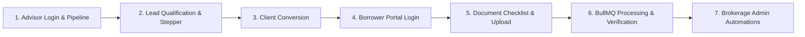
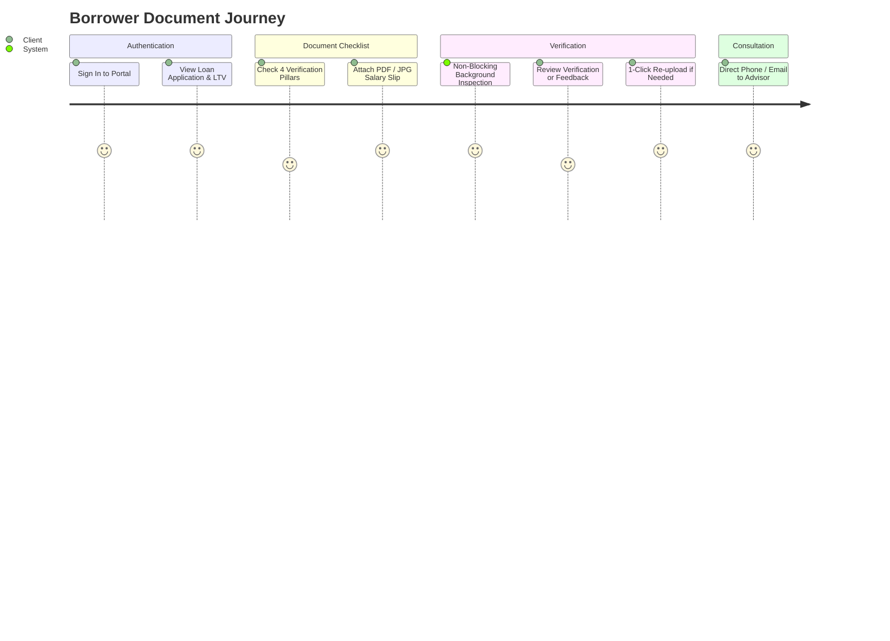

# LeadFlow User Manual & System Guide

> Complete operating instructions for borrowers, mortgage advisors, brokerage administrators, and platform operators.

---

## Table of Contents
1. [Overview](#1-overview)
2. [Recommended Demo Walkthrough](#2-recommended-demo-walkthrough)
3. [User Roles & Access Matrix](#3-user-roles--access-matrix)
4. [Platform Superadmin Guide](#4-platform-superadmin-guide)
5. [Brokerage Administrator Guide](#5-brokerage-administrator-guide)
6. [Mortgage Advisor Guide](#6-mortgage-advisor-guide)
7. [Client & Borrower Portal Guide](#7-client--borrower-portal-guide)
8. [Global Navigation, Shortcuts & Settings](#8-global-navigation-shortcuts--settings)
9. [Troubleshooting & Support](#9-troubleshooting--support)

---

## 1. Overview

LeadFlow is an enterprise, multi-tenant lead and document operating system purpose-built for modern mortgage brokerages. It unifies lead ingestion, real-time qualification pipelines, client portal self-service, background document verification, and automated task workflows into a single high-trust application.

### Key Architectural Invariants
- **Cryptographic Tenant Isolation**: Every brokerage operates within an isolated boundary identified by `brokerageId`. Data queries strictly enforce tenant scoping, and cross-tenant resource queries return uniform HTTP 404 responses to conceal resource existence.
- **Role-Based Access Control (RBAC)**: Four distinct roles (`PLATFORM_ADMIN`, `BROKERAGE_ADMIN`, `ADVISOR`, `CLIENT`) ensure users only access features appropriate to their operational responsibilities.
- **Asynchronous Processing**: File inspection and email delivery are decoupled from HTTP request lifecycles via BullMQ and Redis, keeping user interactions instant and non-blocking.
- **Live Realtime Sync**: WebSocket events update open screens instantly across staff and client workspaces whenever lead stages or document verification states transition.

---

## 2. Recommended Demo Walkthrough

For evaluators and reviewers exploring LeadFlow for the first time, follow this recommended walkthrough sequence to experience the full operational lifecycle:

### Step-by-Step Walkthrough:
1. **Explore the Advisor Pipeline (`/app/pipeline`)**:
   - Sign in as Mortgage Advisor **Elena Schmidt** (`elena.schmidt@berlin-mortgages.de`).
   - Review the 7-stage Kanban board (`NEW`, `CONTACTED`, `QUALIFIED`, `PROPOSAL`, `NEGOTIATION`, `WON`, `LOST`).
   - Drag a lead card forward to experience optimistic updates and state machine enforcement.
   - Click on lead **Marco Rossi** to open the Lead Workspace drawer with financial KPIs, dynamic Loan-to-Value (`LTV %`), and the 6-stage progression stepper.
2. **Convert an Eligible Lead to a Client Case**:
   - On a qualified lead (e.g. `Priya Sharma` in `QUALIFIED`), click the **"Convert to Client Case"** button.
   - Select profile type (`BUYER`), enter a portal password, and confirm conversion.
   - Notice the lead transitions atomically to `WON`, broadcasts to the board, and links to the newly provisioned client profile.
3. **Log in to the Client Portal (`/portal/case`)**:
   - In a private/incognito window or after signing out, sign in as Client **Alex Johnson** (`alex.expat@gmail.com`).
   - Observe the calm, applicant-centric dashboard: 4-stage application milestone tracker, financial summary formatted in Indian Rupees (INR ₹), and assigned advisor contact card.
4. **Upload Checklist Documents (`/portal/documents`)**:
   - Navigate to the **Document Verification Center**.
   - Use the **Indian Home Loan Document Checklist** shortcuts to upload a salary slip or ID proof via the drag-and-drop modal.
   - Watch the document enter `PENDING` status, transition to `PROCESSING`, and update in real-time via Socket.IO without page refreshes.
5. **Inspect Brokerage Automations & Settings (`/app/triggers` & `/app/templates`)**:
   - Sign in as Brokerage Admin **Klaus Mueller** (`klaus.mueller@berlin-mortgages.de`).
   - Review configured stage triggers (automated task generation and email dispatch).
   - Open an email template and launch the **Email Preview Modal** with rendered Indian borrower context.
6. **Verify System-Wide Platform Health (`/admin`)**:
   - Sign in as Platform Superadmin **admin@leadflow-platform.com** (no slug required) to verify global brokerage management and multi-tenant scoping.

---

## 3. User Roles & Access Matrix

| Feature / Workspace | Platform Admin | Brokerage Admin | Mortgage Advisor | Client (Borrower) |
| :--- | :---: | :---: | :---: | :---: |
| **Global Brokerages Oversight (`/admin`)** | ✅ Full Access | ❌ Forbidden | ❌ Forbidden | ❌ Forbidden |
| **Operations Dashboard (`/app`)** | ✅ Read-Only | ✅ Full Access | ✅ Full Access | ❌ Forbidden |
| **Kanban Pipeline Board (`/app/pipeline`)** | ✅ Read-Only | ✅ Full Access | ✅ Full Access | ❌ Forbidden |
| **Lead Workspaces (`/app/leads/:id`)** | ✅ Read-Only | ✅ Full Access | ✅ Full Access | ❌ Forbidden |
| **Client Conversion (`/app/leads/:id/convert`)** | ❌ System Only | ✅ Allowed | ✅ Allowed | ❌ Forbidden |
| **Mortgage Cases Directory (`/app/clients`)** | ✅ Read-Only | ✅ Full Access | ✅ Full Access | ❌ Forbidden |
| **Advisor Task Inbox (`/app/tasks`)** | ✅ Read-Only | ✅ Full Access | ✅ Full Access | ❌ Forbidden |
| **Document Verification Center (`/app/documents`)** | ✅ Read-Only | ✅ Full Access | ✅ Full Access | ❌ Forbidden |
| **Pipeline Triggers (`/app/triggers`)** | ✅ Full Access | ✅ Create & Edit | 👁️ View-Only | ❌ Forbidden |
| **Email Templates (`/app/templates`)** | ✅ Full Access | ✅ Create & Edit | 👁️ View-Only | ❌ Forbidden |
| **Personal Case Portal (`/portal/case`)** | ❌ Staff Route | ❌ Staff Route | ❌ Staff Route | ✅ Own Case Only |
| **Document Upload & Checklist (`/portal/documents`)** | ❌ Staff Route | ❌ Staff Route | ❌ Staff Route | ✅ Own Case Only |
| **Advisor Consultation (`/portal/advisor`)** | ❌ Staff Route | ❌ Staff Route | ❌ Staff Route | ✅ Assigned Advisor |

---

## 4. Platform Superadmin Guide

The **Platform Admin** operates at the infrastructure and platform level across all brokerages.

### How to Sign In
- **URL**: `/login`
- **Email**: `admin@leadflow-platform.com`
- **Password**: `Password123!`
- **Brokerage Slug**: Leave empty (Platform Superadmins authenticate globally without tenant discrimination).

### What You See
Upon login, Platform Admins arrive at the **Platform Overview Workspace** (`/admin`):
- **Brokerage Directory**: A complete roster of all mortgage brokerages deployed on the platform.
- **Brokerage Metadata**: Name, subdomain slug, subscription plan tier (`GROWTH`, `STARTER`, `ENTERPRISE`), account standing (`ACTIVE`, `SUSPENDED`), and copyable Tenant IDs.
- **Tenant Isolation Verification**: Real-time status badge confirming database-level tenant discrimination and cryptographic isolation across all brokerages.

### Primary Workflows & Responsibilities
1. **Onboarding New Brokerages**: Provisioning new tenant entities and issuing unique webhook secrets (`webhookSecret`) for external tool integration.
2. **Monitoring Platform Ingestion Quotas**: Reviewing burst webhook traffic and verifying that high-volume brokerages do not throttle neighboring tenants.
3. **Cross-Tenant Health Audits**: Inspecting platform-wide system health without exposing sensitive borrower PII.

---

## 5. Brokerage Administrator Guide

The **Brokerage Admin** manages operational rules, advisors, email templates, and automated workflows for their firm.

### How to Sign In
- **URL**: `/login`
- **Email**: `klaus.mueller@berlin-mortgages.de`
- **Password**: `Password123!`
- **Brokerage Slug**: `berlin-expat-mortgages` (or click the quick preset chip on the login screen).

### What You See
Brokerage Admins land on the **Executive Operations Dashboard** (`/app`):
- **5 Core Financial KPIs**: Total Inquiries, Active Pipeline Value, Pre-Qualified Volume, Funded Deals (Won Cases), and Active Client Files.
- **Stage Distribution Chart**: Visualization of lead counts and average loan ticket size across all 7 pipeline stages.
- **Recent Borrower Activity**: Real-time audit log of inquiries, stage advancements, and document uploads.
- **Pending Follow-up Tasks**: Urgent operational actions requiring staff attention.

### Primary Workflows & Important Actions

#### 1. Managing Pipeline Stage Triggers (`/app/triggers`)
Automate actions whenever a lead moves from one pipeline stage to another:
- **Navigate**: Click **Automation** in the sidebar or press `G` then `T` and switch tabs.
- **Create Trigger**: Click **"New Trigger Rule"**.
  - **Rule Name**: e.g., "Welcome Email on New Inquiry".
  - **From Stage / To Stage**: Define entry conditions (e.g. `NEW` or `QUALIFIED` → `PROPOSAL`).
  - **Action Type**:
    - `CREATE_TASK`: Automatically generates an advisor task (e.g., "Call applicant within 2 hours") with priority (`HIGH`, `URGENT`) and dynamic due dates (`dueDaysOffset` / `dueHoursOffset`).
    - `SEND_EMAIL`: Dispatches an asynchronous branded email using a linked template.
  - **Toggle Status**: Use the toggle switch on any trigger card to instantly activate or deactivate automation rules.

#### 2. Standardizing Email Templates (`/app/templates`)
Draft and maintain compliant mortgage communication:
- **Navigate**: Click **Email Templates** under the Automation section.
- **Create Template**: Click **"New Template"**. Provide a name, unique slug (e.g., `welcome-expat-inquiry`), email subject, and message body.
- **Interactive Placeholder Chips**: Insert dynamic data chips that interpolate at runtime:
  - `{{lead.firstName}}` — Borrower's first name
  - `{{lead.loanAmount}}` — Requested loan amount formatted in INR
  - `{{advisor.name}}` — Assigned mortgage advisor's full name
  - `{{brokerage.name}}` — Legal name of the brokerage
- **Live Preview Modal**: Click **"Preview"** on any template to inspect real rendered context with prototype pollution security guards active.

---

## 6. Mortgage Advisor Guide

The **Mortgage Advisor** is the primary operator handling borrower files, moving deals through the pipeline, converting leads, and reviewing financial documents.

### How to Sign In
- **URL**: `/login`
- **Email**: `elena.schmidt@berlin-mortgages.de`
- **Password**: `Password123!`
- **Brokerage Slug**: `berlin-expat-mortgages`

### What You See
Advisors land on the **Interactive Pipeline Kanban Board** (`/app/pipeline`):
- **7 Linear Stages**: `NEW` → `CONTACTED` → `QUALIFIED` → `PROPOSAL` → `NEGOTIATION` → `WON` / `LOST`.
- **Column Header Metrics**: Live card counts and total loan volume per stage formatted in Indian Rupees (INR ₹).
- **Multi-Dimensional Filters**: Search by borrower name/email, filter by lead source (`WEBSITE`, `REFERRAL`, `TYPEFORM`, etc.), filter by minimum loan amount threshold (`≥ ₹2,50,000`, `≥ ₹5,00,000` Jumbo), and sort by ticket size or score.
- **Stage Quick-Jump Bar**: Horizontal navigation bar for instant scrolling to any stage column on compact displays.

### Primary Workflows & Important Actions

#### 1. Managing Leads on the Kanban Board
- **Drag-and-Drop Progression**: Click and drag any lead card to advance it forward.
  - The state machine strictly enforces the qualification sequence (`NEW` → `CONTACTED` → `QUALIFIED` → `PROPOSAL` → `NEGOTIATION` → `WON`).
  - Terminal stages (`WON` and `LOST`) cannot be moved backwards.
  - Early drop-off to `LOST` is permitted from any intermediate column.
- **Optimistic Updates & Concurrency**: Card moves reflect instantly on your screen. If another advisor moves the same card simultaneously, the board displays a graceful HTTP 409 conflict alert with **Reload** and **Dismiss** controls to keep data synchronized.
- **Live WebSocket Synchronization**: Remote moves by colleagues update your screen in real time with zero page flickering.

#### 2. Inspecting the Lead Workspace (`/app/leads/:id`)
Click any lead card or table row to open the full inquiry workspace:
- **Borrower Financial KPI Strip**: Displays Target Loan Amount, Estimated Property Value, Monthly Gross Income, and dynamically computed **Loan-to-Value (`LTV %`)**.
- **"Already Known" Recognition**: If the applicant already has an active mortgage file with the brokerage, an alert badge links directly to their existing case profile.
- **Linear Stage Stepper**: Click **"Advance Stage"** to move the file forward, or **"Mark as Lost"** to record an early drop-off with notes.

#### 3. Converting a Lead into a Client Case
When an inquiry reaches `QUALIFIED`, `PROPOSAL`, or `NEGOTIATION`:
1. Click the primary **"Convert to Client Case"** button.
2. In the modal:
   - Select borrower profile type (`BUYER`, `SELLER`, `BOTH`, `OTHER`).
   - Set an initial borrower portal password (or let the system generate a secure default: `Password123!`).
3. Click **"Confirm Conversion"**:
   - The lead transitions atomically to `WON`.
   - A dedicated `User` account (`role: 'CLIENT'`) and `Client` case file are created.
   - Advisor assignment is preserved, and the borrower can now log in to the portal immediately.

#### 4. Managing Client Cases (`/app/clients` & `/app/clients/:id`)
- View all active mortgage files in the firm.
- The dedicated case view displays borrower contact info (with 1-click clipboard copy), linked lead relationship, registered address, and all uploaded verification documents.

#### 5. Advisor Task Inbox (`/app/tasks`)
- Tasks generated by stage automations or manually created appear sorted by urgency:
  - 🔴 **Overdue** (rose alert badge + warning icon)
  - 🟡 **Due Today** (amber badge + clock icon)
  - ⚪ **Upcoming** (slate badge + calendar icon)
- Complete tasks with a single click on the checkbox or status dropdown selector.

#### 6. Document Verification Center (`/app/documents`)
- Review submitted applicant files (salary slips, PAN/Aadhaar KYC proofs, bank statements, sale agreements).
- Inspect file verification status (`VERIFIED`, `PROCESSING (BULLMQ)`, `PENDING`, `REJECTED`).
- Click any document to inspect it safely in a secured browser tab (`target="_blank" rel="noopener noreferrer"`).

---

## 7. Client & Borrower Portal Guide

The **Borrower Portal** is a calm, self-service environment strictly isolated for home loan applicants.

### How to Sign In
- **URL**: `/login`
- **Email**: `alex.expat@gmail.com` (or the email provisioned during lead conversion)
- **Password**: `Password123!`
- **Brokerage Slug**: `berlin-expat-mortgages` (or the specific brokerage slug)

### The Complete Borrower Journey (Step-by-Step)

#### Step 1: Application Case Overview (`/portal/case`)
Upon signing in, borrowers see their personalized mortgage application dashboard:
- **Application Progress Journey**: A 4-milestone visual stepper tracking progress:
  1. *Application Received* (Completed)
  2. *Documents Submitted* (Active)
  3. *Bank Review & Underwriting* (Upcoming)
  4. *Loan Approval & Offer* (Upcoming)
- **Financial Specifications**: Highlights your Target Loan Amount (`₹48,00,000`), Property Valuation (`₹60,00,000`), dynamic Loan-to-Value (`80% LTV`), and Monthly Gross Income formatted in Indian Rupees (INR ₹).
- **Assigned Mortgage Advisor**: Details your dedicated advisor (**Elena Schmidt**) with direct **Email** (`mailto:`) and **Call** (`tel:`) communication links.

#### Step 2: Document Verification Center (`/portal/documents`)
Click **Documents** in the navigation bar to access your personal document checklist:
- **5 Status Filter Buttons**:
  - `All Files`
  - `Verified & Approved` (Green badge)
  - `Under Review` (Amber badge — active BullMQ check)
  - `Queued` (Pending queue)
  - `Needs Action` (Red alert badge — rejected files requiring replacement)
- **Home Loan Document Checklist**: Covers the 4 core pillars required by Indian and international mortgage lenders:
  1. **Identity & KYC Proof**: PAN Card, Aadhaar Card, or Passport.
  2. **Income Proof / Salary Slips**: Last 3 months' salary slips and Form 16.
  3. **Bank Statements**: Last 6 months' primary operating bank account statements.
  4. **Property Documents**: Draft Sale Agreement, layout approvals, or allotment letters.

#### Step 3: Uploading Documents
1. Click **"Upload Document"** or click any checklist shortcut card.
2. In the upload dialog:
   - Drag and drop your file or click to browse (supports PDF, JPEG, PNG, WEBP, TIFF up to 10MB).
   - Select Document Type (e.g. `Salary Slip / Form 16` or `Identity Proof (PAN / Aadhaar)`).
   - Enter an optional title and borrower notes.
3. Click **"Upload Document"**:
   - The upload is non-blocking; the file uploads securely to ImageKit storage and enters `PENDING` status.
   - You are **never** locked or frozen on the upload screen.

#### Step 4: Background Verification & Realtime Updates
- Background workers pick up the file asynchronously for verification checks.
- When verified, the document badge updates instantly to `VERIFIED` with a green checkmark without requiring you to refresh the page.

#### Step 5: Handling Rejections & 1-Click Re-upload
If a file is unreadable, expired, or rejected:
- The file card prominently displays a **Needs Action** banner with explicit feedback (e.g., *"Salary slip for October is missing employer seal. Please upload an official copy."*).
- Click the **"Re-upload Document"** button on the rejected file.
- The upload modal opens with the document type and title pre-populated, and the inspector's feedback highlighted.
- Attach the updated file and submit; the previous rejection is seamlessly replaced.

#### Step 6: Advisor Consultation & Home Loan FAQs (`/portal/advisor`)
- Need assistance or clarification on bank requirements? Navigate to `/portal/advisor`.
- Contact your advisor directly via one-click phone or email.
- Review answers to common mortgage financing questions (down payment percentages, LTV thresholds, self-employed documentation).

---

## 8. Global Navigation, Shortcuts & Settings

### Cmd/Ctrl+K Command Palette
Press `⌘K` (Mac) or `Ctrl+K` (Windows/Linux) from anywhere in the application to:
- Jump directly to any workspace (`Pipeline`, `Leads`, `Clients`, `Tasks`, `Documents`, `Triggers`, `Templates`, `Portal`).
- Search for borrowers, files, and loan cases.
- Copy current workspace URL or toggle the sidebar navigation rail.

### Keyboard Shortcuts Cheatsheet
Press `?` to open the full shortcut guide:
- `G` then `P` → Jump to Pipeline Board
- `G` then `L` → Jump to Leads Directory
- `G` then `C` → Jump to Mortgage Clients
- `G` then `T` → Jump to Tasks Inbox
- `G` then `D` → Jump to Document Center
- `G` then `U` → Open Profile & Preferences Modal
- `⌘B` / `Ctrl+B` → Toggle Sidebar Navigation Rail
- `Esc` → Close active modal or drawer

### Profile & Settings Modal (`G U` or Avatar Dropdown)
Accessible to all four user roles:
- **Identity & Profile**: Avatar, name, role badge, User ID, and verified email.
- **Organization & Brokerage**: Brokerage legal name, slug, plan tier, copyable ID, and tenant isolation status banner.
- **Localization & Preferences**: Base currency (`Indian Rupee INR — ₹`), numbering system (`Lakhs & Crores`), date format, and WebSocket connection status.
- **Security & Session**: Active token lifespans (15-minute access JWT, 7-day RFC 6819 refresh lineage), anti-IDOR verification, and sign-out controls.

---

## 9. Troubleshooting & Support

### Common Questions & Resolutions

#### 1. Why do I see a 404 error when opening a lead or client link?
LeadFlow enforces strict multi-tenant and case-level IDOR concealment. If you attempt to access an ID belonging to a different brokerage or another borrower's file, the system returns HTTP 404 (`NotFoundError`) to completely conceal whether the resource exists.

#### 2. Why did my card bounce back on the Kanban board?
LeadFlow enforces strict forward qualification stages (`NEW → CONTACTED → QUALIFIED → PROPOSAL → NEGOTIATION → WON`). Skipping stages, backwards moves, or moving terminal stages (`WON`/`LOST`) is rejected by the server state machine and automatically rolled back.

#### 3. What should I do if a concurrency conflict alert appears?
If two advisors update the same lead at the same millisecond, LeadFlow's optimistic concurrency defense blocks the stale update. Click **Reload** on the notification banner to fetch the latest committed data.

#### 4. Which file types and sizes are supported for uploads?
Uploads support PDF, JPEG, PNG, WEBP, and TIFF files up to 10MB per document.

---

*LeadFlow © 2026. Built with MERN, BullMQ, Redis, and Socket.IO.*
