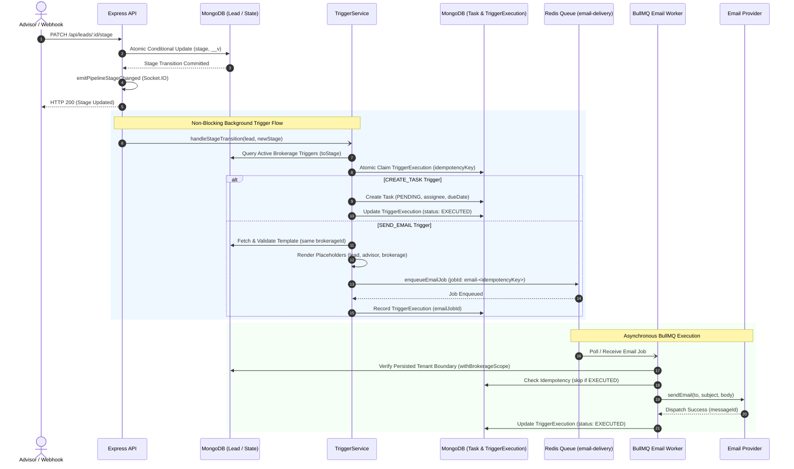

# Pipeline Triggers, Advisor Tasks & Email Automation

## 1. Overview & Architectural Role

In mortgage advisory workflows, prospective buyers and expats transition through distinct qualification stages (`NEW → CONTACTED → QUALIFIED → PROPOSAL → NEGOTIATION → WON / LOST`). As leads progress through these stages, operational SLAs require immediate team engagement (e.g. "Call within 2 hours" for new inquiries) and automated borrower communications (e.g. customized welcome emails with advisor contact details).

Phase 7 Prompt 1 establishes the backend automation layer connecting the pipeline Kanban state machine to:
1. **Advisor Task Automation**: Automatic task provisioning with dynamic assignee assignment, parameterized due dates, and overdue-safe statuses.
2. **Email Template Dispatching**: Dynamic placeholder rendering (`{{firstName}}`, `{{advisor.name}}`, `{{brokerage.name}}`, custom fields) dispatched asynchronously through BullMQ.
3. **Ironclad Multi-Tenant Idempotency**: Atomic claim tracking in MongoDB and BullMQ deduplication to guarantee zero duplicate tasks or duplicate emails under high-concurrency race conditions.
4. **Resilient Background Execution**: Decoupled non-blocking execution preserving pipeline stage transition speed, backed by bounded exponential backoff and sanitized observability.

---

## 2. Trigger Lifecycle Architecture

---

## 3. Dynamic Placeholder Rendering

The template engine in `server/src/utils/template.ts` resolves both nested paths (`{{lead.firstName}}`, `{{advisor.email}}`, `{{brokerage.name}}`, `{{customFields.propertyCity}}`) and flat aliases (`{{firstName}}`, `{{advisorName}}`, `{{brokerageName}}`, `{{stage}}`).

### Context Population Matrix

| Variable | Nested Path | Description | Fallback |
| :--- | :--- | :--- | :--- |
| `firstName` | `lead.firstName` | Lead's first name | `""` |
| `lastName` | `lead.lastName` | Lead's last name | `""` |
| `fullName` | `lead.fullName` | Lead's combined name | `""` |
| `email` | `lead.email` | Lead's email address | `""` |
| `phone` | `lead.phone` | Contact phone number | `""` |
| `score` | `lead.score` | Qualification score (0–100) | `0` |
| `stage` | `lead.status` | Target pipeline stage | `""` |
| `advisorName` | `advisor.name` | Assigned advisor's full name | `""` |
| `advisorEmail`| `advisor.email`| Assigned advisor's email | `""` |
| `brokerageName`| `brokerage.name`| Name of the brokerage firm | `""` |
| `customFields.*` | `customFields.*` | Arbitrary key-value metadata | `""` |

Missing variables evaluate safely to empty strings `""` without throwing errors or exposing `undefined`.

### Security & Anti-Leak Guarantees
- **Prototype Pollution Defense**: Path resolution blocks access to `__proto__`, `constructor`, `prototype`, `toString`, `valueOf`, and any prototype chain methods, resolving them to empty strings `""`.
- **Own-Property Enforcement**: Object property traversal strictly requires `Object.prototype.hasOwnProperty.call(current, part)`, preventing traversal of object prototypes.
- **Function Suppression**: Functions in context are never evaluated or stringified; they resolve to `""`.
- **Secret Sanitization**: Custom fields and extra parameters matching `/password|token|secret|hash|apiKey|auth|creditCard|ssn/i` are automatically excluded from the template context, preventing accidental token or password leakage into emails.

---

## 4. Multi-Tenant Idempotency & Deduplication

Stage events can be dispatched concurrently or retried across distributed services. LeadFlow enforces a 3-layer deduplication defense:

1. **MongoDB Atomic Claim Layer (`TriggerExecution`)**:
   - Each trigger execution generates an immutable idempotency key:
     `trigger:${leadId}:${triggerId}:${toStage}`
   - The collection enforces a compound unique index:
     `{ brokerageId: 1, idempotencyKey: 1 }` with `{ unique: true }`.
   - Concurrent workers or duplicate stage events attempting to execute the same trigger encounter MongoDB error code `11000` (duplicate key), immediately halting duplicate task creation or email enqueuing.

2. **BullMQ Custom Job ID Layer**:
   - BullMQ dispatches email jobs with a sanitized, deterministic `jobId`:
     `email-trigger-${leadId}-${triggerId}-${toStage}` (colons sanitized to dashes to conform to BullMQ Redis key specifications).
   - If a duplicate job is sent to Redis, BullMQ native deduplication rejects or ignores the duplicate addition.

3. **Worker-Level State Verification**:
   - Before invoking external email relays, the worker inspects `TriggerExecution`. If `status === 'EXECUTED'`, the job logs the duplicate delivery and exits cleanly without re-transmitting.

---

## 5. Fault Tolerance & Bounded Retry Matrix

Email provider failures are classified into retryable and terminal outcomes:

| Failure Type | Example Triggers | Worker Behavior | Outcome |
| :--- | :--- | :--- | :--- |
| **Transient Error** | Network timeout, upstream 429 rate limit, 503 gateway failure | Throws `EmailProviderTransientError` | BullMQ retries up to 3 attempts with exponential backoff (1s, 2s, 4s). |
| **Terminal Error** | Invalid mailbox syntax, domain MX rejection, blacklisted sender | Throws `UnrecoverableError` | Immediate failure without retry; updates `TriggerExecution` to `status: 'FAILED'`. |
| **Exhausted Attempts** | Upstream relay down after all 3 retries | Worker event `failed` | Updates `TriggerExecution` to `status: 'FAILED'` with audit message. |

---

## 6. Security, Anti-Tampering & Observability

- **Cross-Brokerage Template Isolation**: Triggers referencing an `EmailTemplate` belonging to another tenant are rejected during trigger evaluation with security alerts; no emails are dispatched across tenant boundaries.
- **Worker Anti-Tampering Guard**: Every worker job validates that `payload.brokerageId` strictly matches the persisted database document for `leadId` via `withBrokerageScope`. Any mismatch throws `UnrecoverableError` immediately.
- **Sanitized Logging (PII & Secret Protection)**:
  - All email addresses are masked via `maskEmail` (e.g. `alex.expat@gmail.com` → `a***t@gmail.com`).
  - Passwords, API tokens, JWT secrets, and raw sensitive email bodies are never logged to Pino.
